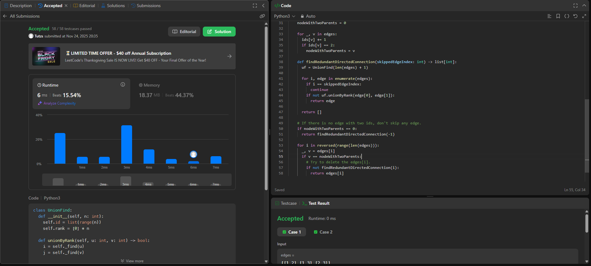
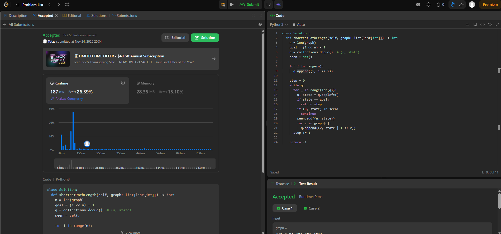

## Alunos  
| Matrícula | Nome |  
|-----------------------|---------------------|  
| 22/1007958 | Cláudio Henrique dos Santos Carvalho |  
| 22/1022462 | Arthur da Silveira Sousa |

## Descrição do projeto

Questões resolvidas do LeetCode sobre Grafos da disciplina de Estrutura de Dados 2.

### Questões

|Questão | Dificuldade | Autor|
| -- | -- | -- |
| [114. Flatten Binary Tree to Linked List](https://leetcode.com/problems/flatten-binary-tree-to-linked-list/description/)| Média | Cláudio|
| [124. Binary Tree Maximum Path Sum](https://leetcode.com/problems/binary-tree-maximum-path-sum/)| Difícil | Cláudio|
| [685. Redundant Connection II](https://leetcode.com/problems/redundant-connection-ii/description/) | Difícil | Arthur |
| [847. Shortest Path Visiting All Nodes](https://leetcode.com/problems/shortest-path-visiting-all-nodes/description/) | Difícil | Arthur |

## Guia de instalação

Basta executar os scripts python na área específica de cada exercício que estão na pasta de questões de cada aluno.

## Capturas de tela

#### Cláudio

### [114. Flatten Binary Tree to Linked List](https://leetcode.com/problems/flatten-binary-tree-to-linked-list/description/)

### [124. Binary Tree Maximum Path Sum](https://leetcode.com/problems/binary-tree-maximum-path-sum/)

#### Arthur

### [685. Redundant Connection II](https://leetcode.com/problems/redundant-connection-ii/description/)

### [847. Shortest Path Visiting All Nodes](https://leetcode.com/problems/shortest-path-visiting-all-nodes/description/)

## Gravação

[Link do vídeo - Cláudio Henrique]()

[Link do vídeo - Arthur Sousa]()

## Conclusões

Cláudio:

Arthur: